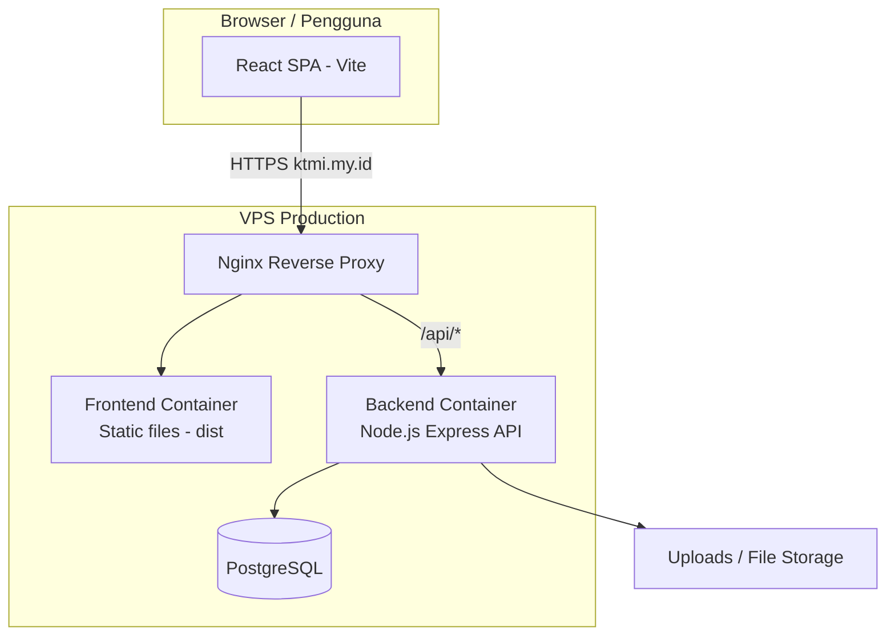
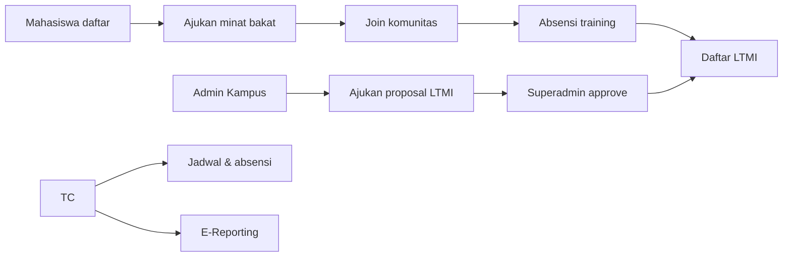

# KTMI — Komunitas Talenta Mahasiswa Indonesia

> Platform digital untuk mengelola keanggotaan, komunitas, minat bakat, pelatihan, dan lomba talenta mahasiswa di lingkungan **LLDIKTI Wilayah XVII**.

**Production:** [https://ktmi.my.id](https://ktmi.my.id)

---

## Tentang Aplikasi

**KTMI (Komunitas Talenta Mahasiswa Indonesia)** adalah sistem informasi berbasis web yang dirancang untuk mendigitalisasi pengelolaan talenta mahasiswa. Aplikasi ini menghubungkan mahasiswa, admin kampus, Training Community (TC), dan super administrator dalam satu ekosistem terpadu.

Melalui KTMI, mahasiswa dapat:

- Mendaftar dan memiliki **Kartu Tanda Anggota (KTA)** digital dengan QR verifikasi
- Bergabung dengan **komunitas** berbasis minat bakat
- Mencatat **absensi** kegiatan training
- Mengajukan **minat bakat** dan mengikuti **LTMI** (Liga Talenta Mahasiswa Indonesia)
- Berdiskusi di **forum** internal

Bagi pengelola kampus dan LLDIKTI, KTMI menyediakan dashboard untuk validasi pengajuan, pengelolaan data mahasiswa, proposal lomba, jadwal training, laporan kegiatan, serta administrasi sistem secara terpusat.

---

## Peran Pengguna

| Peran | Deskripsi Singkat |
|-------|-------------------|
| **Mahasiswa** | Profil, KTA, komunitas, absensi, pengajuan minat bakat, pendaftaran LTMI, forum |
| **Admin Kampus** | Kelola mahasiswa & komunitas kampus, ajukan LTMI, validasi pengajuan, monitoring training |
| **Training Community (TC)** | Jadwal training, absensi, e-reporting, permintaan keluar komunitas, monitoring LTMI |
| **Super Administrator** | Kelola user, PTS, LTMI, approval, TC, prestasi, minat bakat, laporan sistem |

Setiap peran memiliki dashboard dan menu sidebar yang disesuaikan dengan tanggung jawabnya.

---

## Fitur Utama

### Keanggotaan & Identitas
- Registrasi mahasiswa terhubung data PTS/kampus
- **KTA digital** — nama, foto, nomor anggota, QR code
- Verifikasi keanggotaan publik via `/verify/:kta`

### Komunitas & Minat Bakat
- Komunitas dengan filter minat bakat (maks. 3 bakat aktif per mahasiswa)
- Aturan **satu komunitas per mahasiswa**
- Pengajuan keluar komunitas dengan persetujuan TC

### Pelatihan & Absensi
- TC membuat jadwal training
- Mahasiswa konfirmasi kehadiran; TC mencatat status absensi

### LTMI (Liga Talenta Mahasiswa Indonesia)
- Admin Kampus mengajukan proposal lomba + dokumen pendukung
- Super Administrator memvalidasi (approve/reject)
- Mahasiswa mendaftar ke lomba berstatus **OPEN**

### Lainnya
- **Forum** diskusi antar anggota
- **Notifikasi** real-time
- **Asisten KTMI** — chatbot bantuan berbasis knowledge base
- **Pusat Bantuan** — FAQ per peran pengguna
- **Command Palette** (`Ctrl+K`) untuk navigasi cepat
- **Galeri Momen Kegiatan** di landing page
- **Laporkan Bug** untuk feedback pengguna

---

## Bagaimana Aplikasi Berjalan

### Arsitektur Sistem

### Alur Singkat

1. **Pengguna** membuka `https://ktmi.my.id` di browser.
2. **Frontend** (React) dimuat sebagai Single Page Application (SPA).
3. Setiap aksi (login, daftar komunitas, upload dokumen, dll.) memanggil **REST API** di `/api`.
4. **Backend** (Express.js) memproses request, autentikasi JWT, dan berinteraksi dengan **PostgreSQL**.
5. File upload (foto profil, dokumen LTMI, laporan kegiatan) disimpan di folder `uploads` dan dilayani sebagai static file.

### Alur Bisnis Utama

---

## Tech Stack

| Lapisan | Teknologi |
|---------|-----------|
| **Frontend** | React 19, TypeScript, Vite, Tailwind CSS, shadcn/ui, Framer Motion |
| **Backend** | Node.js, Express.js, JWT, Multer |
| **Database** | PostgreSQL |
| **Deployment** | Docker, Docker Compose, Nginx |
| **Keamanan** | Helmet, CORS, Rate limiting, bcrypt |

---

## Lingkungan Aplikasi

| Lingkungan | Keterangan |
|------------|------------|
| **Production** | `https://ktmi.my.id` — diakses publik oleh pengguna |
| **Development** | Server lokal — Vite dev server + backend dev untuk pengujian fitur |

Frontend production di-build menjadi file statis (`dist/`) lalu dilayankan oleh container Nginx. Perubahan kode frontend **harus di-build ulang** agar tampil di production.

---

## Keamanan & Privasi

- Autentikasi berbasis **JWT** (JSON Web Token)
- Password di-hash sebelum disimpan
- Rate limiting pada endpoint API
- Log sensitif dan data PII tidak ditampilkan di konsol production
- CORS dikonfigurasi khusus domain production

---

## Dokumentasi Pendukung

Panduan penggunaan (format PDF, standalone) tersedia untuk:

- Cara mengajukan LTMI
- Cara bergabung komunitas
- Panduan per peran: Mahasiswa, Admin Kampus, TC, Super Administrator

---

## Developer

**Mhd Farhan Jafrad** — Developer & pengembang utama aplikasi KTMI

---

## Catatan Repositori

Repositori ini berisi **dokumentasi pengenalan** aplikasi KTMI. Source code lengkap tidak dipublikasikan di GitHub ini.

Untuk informasi lebih lanjut mengenai penggunaan platform, silakan kunjungi [ktmi.my.id](https://ktmi.my.id) atau hubungi admin LLDIKTI Wilayah XVII.

---

## Lisensi & Hak Cipta

© LLDIKTI Wilayah XVII — Komunitas Talenta Mahasiswa Indonesia (KTMI)
