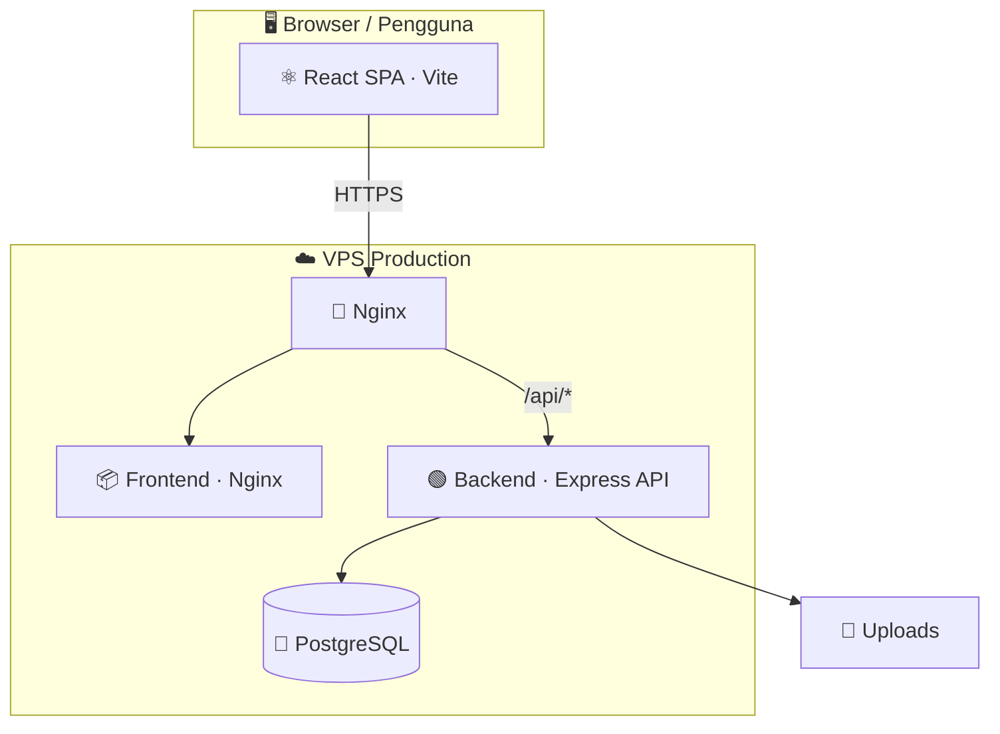
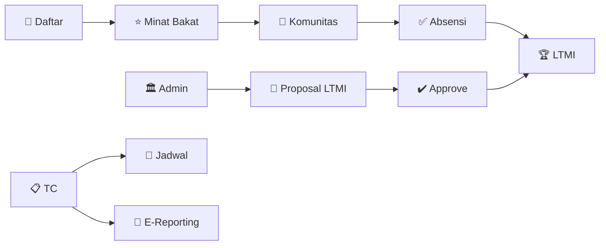

<div align="center">


# 🎓 KTMI — Komunitas Talenta Mahasiswa Indonesia

**Platform digital talenta mahasiswa untuk LLDIKTI Wilayah XVII**

[](https://ktmi.my.id)
[](https://react.dev)
[](https://nodejs.org)
[](https://postgresql.org)

*Mengelola keanggotaan · komunitas · minat bakat · pelatihan · lomba talenta*

[🚀 Kunjungi Aplikasi](https://ktmi.my.id) · [📖 Tentang](#-tentang-aplikasi) · [👥 Peran](#-peran-pengguna) · [⚙️ Cara Kerja](#%EF%B8%8F-bagaimana-aplikasi-berjalan)

</div>

---

## 📌 Tentang Aplikasi

**KTMI (Komunitas Talenta Mahasiswa Indonesia)** adalah sistem informasi berbasis web yang mendigitalisasi pengelolaan talenta mahasiswa. Aplikasi ini menghubungkan **mahasiswa**, **admin kampus**, **Training Community (TC)**, dan **super administrator** dalam satu ekosistem terpadu.

### 🎯 Untuk Mahasiswa

| | Fitur |
|---|------|
| 🪪 | **KTA Digital** — kartu anggota + QR verifikasi |
| 👥 | **Komunitas** — bergabung sesuai minat bakat |
| ✅ | **Absensi** — kehadiran kegiatan training |
| ⭐ | **Minat Bakat** — ajukan & kelola bakat Anda |
| 🏆 | **LTMI** — ikuti lomba Liga Talenta Mahasiswa Indonesia |
| 💬 | **Forum** — diskusi dengan anggota KTMI |

### 🏫 Untuk Pengelola

Dashboard terpusat untuk validasi pengajuan, kelola data mahasiswa & PTS, proposal lomba, jadwal training, e-reporting, serta administrasi sistem LLDIKTI.

---

## 👥 Peran Pengguna

| Peran | Emoji | Deskripsi |
|-------|-------|-----------|
| **Mahasiswa** | 🎒 | Profil, KTA, komunitas, absensi, minat bakat, LTMI, forum |
| **Admin Kampus** | 🏛️ | Kelola mahasiswa & komunitas, ajukan LTMI, validasi pengajuan |
| **Training Community** | 📋 | Jadwal training, absensi, e-reporting, permintaan keluar komunitas |
| **Super Administrator** | 🛡️ | Kelola user, PTS, LTMI, approval, TC, prestasi, laporan |

> Setiap peran memiliki **dashboard & sidebar** yang disesuaikan dengan tanggung jawabnya.

---

## ✨ Fitur Utama

<details>
<summary><b>🪪 Keanggotaan & Identitas</b></summary>

- 📝 Registrasi mahasiswa terhubung data PTS/kampus
- 🪪 **KTA digital** — nama, foto, nomor anggota, QR code
- 🔍 Verifikasi keanggotaan publik via `/verify/:kta`

</details>

<details>
<summary><b>👥 Komunitas & Minat Bakat</b></summary>

- 🎯 Komunitas dengan filter minat bakat
- 📊 Maks. **3 bakat aktif** per mahasiswa
- 1️⃣ Aturan **satu komunitas** per mahasiswa
- 🚪 Pengajuan keluar komunitas (approval TC)

</details>

<details>
<summary><b>📅 Pelatihan & Absensi</b></summary>

- 📆 TC membuat jadwal training
- ✅ Mahasiswa konfirmasi kehadiran
- 📋 TC mencatat status: hadir, terlambat, izin, alpha

</details>

<details>
<summary><b>🏆 LTMI — Liga Talenta Mahasiswa Indonesia</b></summary>

- 📄 Admin Kampus mengajukan proposal + dokumen pendukung
- ✔️ Super Administrator memvalidasi (approve / reject)
- 🎯 Mahasiswa mendaftar ke lomba berstatus **OPEN**

</details>

<details>
<summary><b>🚀 Fitur Tambahan</b></summary>

| Fitur | Keterangan |
|-------|------------|
| 💬 **Forum** | Diskusi antar anggota |
| 🔔 **Notifikasi** | Pemberitahuan real-time |
| 🤖 **Asisten KTMI** | Chatbot bantuan berbasis knowledge base |
| ❓ **Pusat Bantuan** | FAQ per peran pengguna |
| ⌨️ **Ctrl+K** | Command palette navigasi cepat |
| 📸 **Galeri Momen** | Slideshow kegiatan di landing page |
| 🐛 **Laporkan Bug** | Feedback dari pengguna |

</details>

---

## ⚙️ Bagaimana Aplikasi Berjalan

### 🏗️ Arsitektur Sistem



### 🔄 Alur Singkat

```
1. 👤 Pengguna buka ktmi.my.id
2. ⚛️  Frontend React (SPA) dimuat di browser
3. 📡 Setiap aksi → REST API /api
4. 🟢 Backend Express + JWT → PostgreSQL
5. 📁 Upload file → folder uploads
```

### 📊 Alur Bisnis Utama



---

## 🛠️ Tech Stack

| Lapisan | Teknologi |
|---------|-----------|
| 🎨 **Frontend** | React 19 · TypeScript · Vite · Tailwind CSS · shadcn/ui |
| ⚡ **Animasi** | Framer Motion |
| 🟢 **Backend** | Node.js · Express.js · JWT · Multer |
| 🐘 **Database** | PostgreSQL |
| 🐳 **Deploy** | Docker · Docker Compose · Nginx |
| 🔒 **Keamanan** | Helmet · CORS · Rate Limiting · bcrypt |

---

## 🌍 Lingkungan

| Lingkungan | URL / Keterangan |
|------------|------------------|
| 🌐 **Production** | [ktmi.my.id](https://ktmi.my.id) — akses publik |
| 🔧 **Development** | Server lokal — Vite + backend dev |

> 💡 Frontend production di-build ke `dist/` lalu dilayankan Nginx. Perubahan kode **harus di-build ulang** agar tampil live.

---

## 🔐 Keamanan & Privasi

- 🔑 Autentikasi **JWT**
- 🔒 Password di-hash (**bcrypt**)
- 🚦 Rate limiting pada API
- 🛡️ Log sensitif & PII diamankan di production
- 🌐 CORS dikonfigurasi untuk domain production

---

## 📚 Dokumentasi

Panduan penggunaan (PDF) tersedia untuk:

| 📄 Panduan | Isi |
|-----------|-----|
| 🏆 LTMI | Cara mengajukan proposal lomba |
| 👥 Komunitas | Cara bergabung & syarat minat bakat |
| 🎒 Mahasiswa | Panduan lengkap peran mahasiswa |
| 🏛️ Admin Kampus | Kelola kampus & validasi |
| 📋 TC | Training, absensi, e-reporting |
| 🛡️ Superadmin | Administrasi sistem |

---

## 👨‍💻 Developer

<div align="center">

**Mhd Farhan Jafrad**

*Developer & Pengembang Utama — KTMI*

</div>

---

## 📦 Catatan Repositori

> ⚠️ Repositori ini berisi **dokumentasi & pengenalan** aplikasi KTMI.  
> Source code lengkap **tidak dipublikasikan** di GitHub ini.

Untuk menggunakan platform, kunjungi 👉 **[ktmi.my.id](https://ktmi.my.id)**

---

<div align="center">

**© 2026 LLDIKTI Wilayah XVII — Komunitas Talenta Mahasiswa Indonesia**

*Made with ❤️ for Indonesian student talent*

</div>
