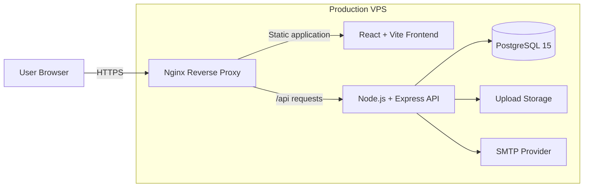

<!--
Add a project banner when it is ready, for example:

  

-->

<h1 align="center">KTMI — Komunitas Talenta Mahasiswa Indonesia</h1>

  A production-deployed student talent management platform for LLDIKTI Region XVII.

  <a href="https://ktmi.my.id"><strong>Live Application</strong></a>
  ·
  <a href="./PORTFOLIO-DOCUMENTATION.md"><strong>Technical Documentation</strong></a>
  ·
  <a href="https://github.com/Hann000"><strong>Developer Profile</strong></a>

  
  
  
  
  
  

---

## Overview

**KTMI** is a full-stack web platform that centralizes student talent administration across private universities coordinated by **LLDIKTI Region XVII**.

The system replaces fragmented workflows—spreadsheets, paper forms, disconnected messaging groups, and manual approvals—with one role-based platform for:

- student membership and profile management;
- talent and interest submissions;
- community membership;
- training schedules and attendance;
- LTMI competition proposals and registrations;
- achievement verification;
- digital membership cards with public QR verification;
- multi-level reporting and approval workflows.

This repository presents KTMI as a **portfolio case study**, focusing on the product problem, system architecture, engineering decisions, security model, and production deployment.

## Project at a Glance

| Area | Scope |
|---|---|
| Product type | Multi-role student talent management system |
| Primary users | Students, training coordinators, campus administrators, super administrators |
| Access model | Four-role RBAC with campus-level data scoping |
| Backend surface | Approximately 150 REST endpoints across 18 route modules |
| Data model | 23+ PostgreSQL tables with UUID keys, constraints, indexes, and audit fields |
| Authentication | Email OTP, JWT, and server-side sessions |
| Infrastructure | Docker Compose, Nginx, PostgreSQL, production VPS |
| Live deployment | [ktmi.my.id](https://ktmi.my.id) |

## The Problem

Student activity administration across multiple campuses was difficult to monitor because data lived in separate spreadsheets, paper documents, and informal communication channels.

The main operational issues were:

- no centralized view of students, communities, attendance, or competitions;
- slow proposal and approval processes;
- weak traceability for administrative decisions;
- difficult verification of membership and achievements;
- inconsistent data access between institutional roles.

KTMI addresses these issues through structured workflows, role-scoped dashboards, auditable approval records, and publicly verifiable digital credentials.

## Core Capabilities

### Digital identity and onboarding

- Student registration with email OTP verification.
- Secure login using JWT and server-side session validation.
- Automatically generated KTA membership numbers.
- Digital membership card with QR-based public verification.

### Talent and community management

- Talent and interest submissions with approval states.
- Maximum of three active talents per student.
- Community discovery based on talent category.
- One-community-per-student business rule.
- Join and leave requests with role-specific approval.

### Training and attendance

- Training schedule management by community coordinators.
- Attendance statuses: present, absent, late, and excused.
- Student attendance history.
- Activity reports and periodic e-reporting.

### LTMI competition workflow

- Competition proposal creation by campus administrators.
- Proposal, budget, and timeline document uploads.
- Superadmin approval and rejection with review notes.
- Student registration for open competitions.
- Participant and registration approval management.

### Reporting and communication

- Role-specific dashboards and statistics.
- Two-level approval for selected submissions.
- Achievement submission and verification.
- Forum posts, comments, likes, and attachments.
- Server-Sent Events for notification updates.

## User Roles

| Capability | Student | Training Coordinator | Campus Admin | Superadmin |
|---|:---:|:---:|:---:|:---:|
| Manage own profile | ✓ | ✓ | ✓ | ✓ |
| View digital KTA | ✓ | — | — | — |
| Submit talents and achievements | ✓ | — | — | — |
| Join a community | ✓ | — | — | — |
| Manage training and attendance | — | ✓ | — | — |
| Submit reports | — | ✓ | — | — |
| Manage campus-scoped data | — | — | ✓ | — |
| Submit LTMI proposals | — | — | ✓ | — |
| Approve final proposals | — | — | — | ✓ |
| Manage global users and PTS data | — | — | — | ✓ |

Authorization is enforced at two levels:

1. **Endpoint-level access** through reusable role middleware.
2. **Row-level data scoping** so campus administrators only access records belonging to their institution.

## My Role

I designed and implemented KTMI as a full-stack project, covering:

- requirements analysis and workflow modeling;
- frontend architecture and role-specific interfaces;
- REST API design and backend implementation;
- relational database design and migrations;
- authentication, authorization, and session management;
- Docker and Nginx production deployment;
- security hardening and operational documentation;
- user guides and technical documentation.

The project demonstrates end-to-end ownership: converting institutional processes into software rules, shipping the system, and maintaining it in a production environment.

## System Architecture

### Request flow

1. The React client sends requests to the API using a Bearer token.
2. Nginx routes frontend traffic and proxies `/api` requests to Express.
3. The authentication middleware validates the JWT, session record, account status, and role.
4. Route handlers apply campus or ownership scoping before querying PostgreSQL.
5. Approval actions generate auditable records and user notifications.

## Technology Stack

| Layer | Technologies |
|---|---|
| Frontend | React 19, TypeScript, Vite, Tailwind CSS, shadcn/ui, React Router, TanStack Query, Zustand |
| Forms and validation | React Hook Form, Zod |
| Visualization | Recharts, Framer Motion |
| Backend | Node.js, Express, node-postgres, Multer, Nodemailer |
| Authentication | JWT, bcrypt, email OTP, server-side sessions |
| Database | PostgreSQL 15, UUID, JSONB, arrays, triggers, constraints, indexes |
| Infrastructure | Docker Compose, Nginx, Ubuntu VPS |
| Security middleware | Helmet, CORS, rate limiting, compression |

## Selected Engineering Decisions

### Hybrid JWT and server-side sessions

JWT provides efficient stateless verification, while the session table adds immediate revocation, expiration tracking, client metadata, and account-status enforcement. This prevents a deactivated account from remaining active until its token naturally expires.

### Workflow state machines

Several modules model real administrative processes as explicit state transitions instead of simple CRUD records. Examples include:

- LTMI proposals: `draft → pending → open/rejected → closed/completed`;
- talent submissions and change requests;
- two-stage approval for selected coordinator submissions;
- achievement verification and competition registration review.

### Database-enforced business rules

Critical rules are not left solely to the interface. The database uses foreign keys, unique constraints, check constraints, and indexed relationships to prevent duplicate registrations and preserve data integrity.

### Role and campus scoping

Role authorization alone is insufficient for a multi-campus platform. Campus administrators are restricted to their institution's records at query level, while superadmins retain cross-campus access.

## Security

- Password hashing with bcrypt.
- OTP verification before student account creation.
- JWT signature and expiration validation.
- Server-side session checks and logout invalidation.
- Role allow-lists and ownership checks.
- Campus-level data isolation.
- Parameterized PostgreSQL queries.
- CORS origin allow-list.
- Helmet security headers.
- API rate limiting behind Nginx.
- File type and size restrictions for uploads.
- Environment-based secret management.

## Product Preview

Screenshots should show the product rather than the repository page. The most useful portfolio sequence is:

1. landing page and authentication;
2. student dashboard and digital KTA;
3. community and talent workflow;
4. training attendance interface;
5. LTMI proposal and approval flow;
6. superadmin analytics dashboard;
7. responsive mobile views.

<!--
Recommended gallery structure after screenshots are added:

<table>
  <tr>
    <td></td>
    <td></td>
  </tr>
  <tr>
    <td align="center"><strong>Student Dashboard</strong></td>
    <td align="center"><strong>Digital Membership Card</strong></td>
  </tr>
</table>
-->

## Engineering Challenges

- Translating multi-level institutional approvals into consistent state transitions.
- Combining JWT convenience with server-side revocation.
- Enforcing campus boundaries in a shared database.
- Handling rate limiting correctly behind an Nginx reverse proxy.
- Keeping frontend and backend environment configuration safe across local and production builds.
- Designing a schema that supports auditability without blocking future feature expansion.

## Current Limitations and Roadmap

The largest remaining engineering gaps are:

- automated unit, integration, and end-to-end testing;
- CI/CD through GitHub Actions;
- OpenAPI/Swagger documentation;
- centralized backend request validation;
- object storage for uploaded files;
- Redis-backed session and rate-limit infrastructure;
- formal audit logs for privileged actions.

These items are intentionally documented because they represent the next steps required to improve reliability, maintainability, and scalability.

## Documentation

The complete technical package contains feature documentation, API summaries, database relationships, deployment details, security notes, and a repository audit:

- [Live Application](https://ktmi.my.id)

## Author

**Mhd Farhan Jafrad**  
GitHub: [@Hann000](https://github.com/Hann000)

---

  Built as an end-to-end full-stack engineering project for real institutional workflows.

